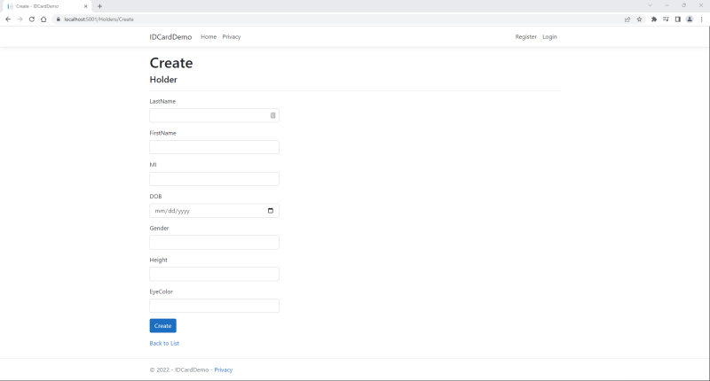
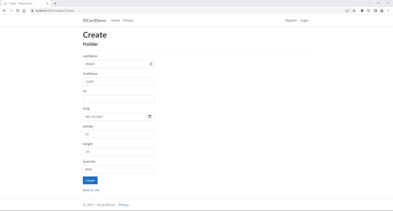
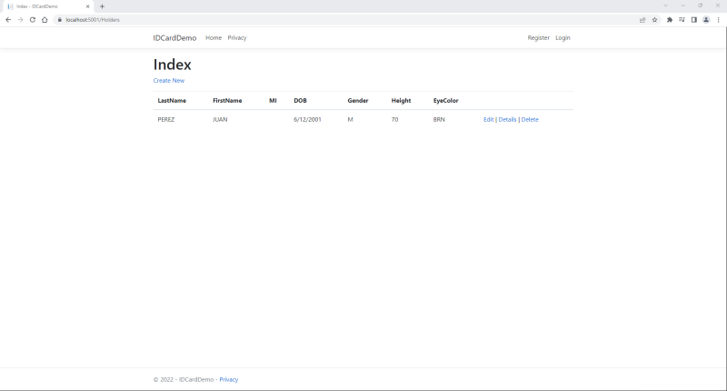
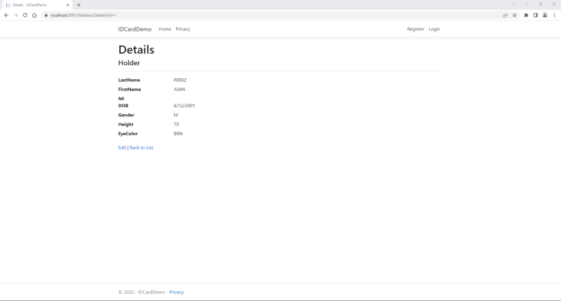
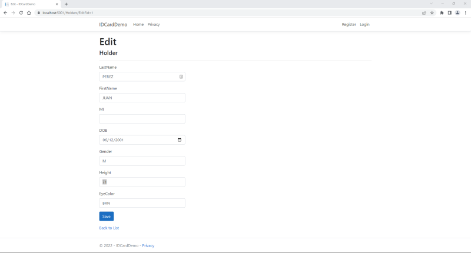
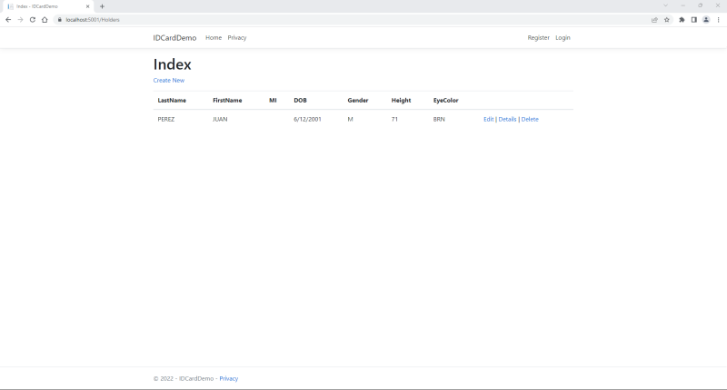
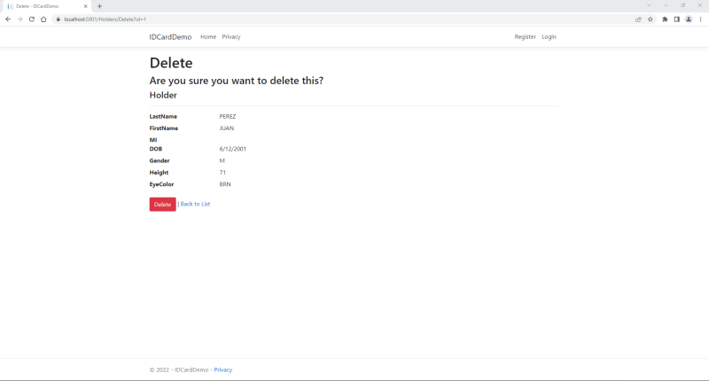
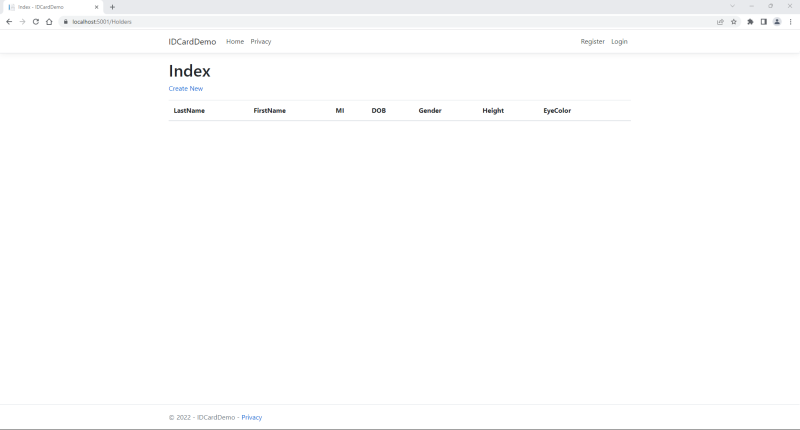
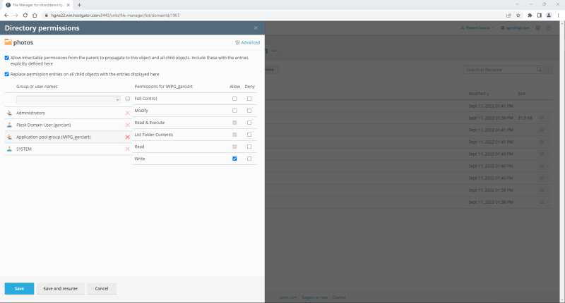

# ID Card Demo

>**NOTE** - This demo uses .NET Core 3.1. While .NET 6 has superceded .NET Core 3.1, and .NET Core 3.1 end-of-support date is December 13, 2022, you will use it, since not all servers support .NET 6 yet.

>**NOTE** - This is a customization of the instructions found at https://docs.microsoft.com/en-us/aspnet/core/tutorials/razor-pages/razor-pages-start?view=aspnetcore-3.1&tabs=visual-studio-code.

## Setup

Open a Windows Terminal and ensure the latest version of .NET Core SDK 3.1, is installed:

```
dotnet --list-sdks
```

If not, download the latest version of .NET Core SDK 3.1 from https://dotnet.microsoft.com/en-us/download/dotnet/3.1

Enter the following commands to create a Razor web application that uses .NET Core 3.1 and individual authentication:

**NOTE** - For portability, you will use individual authentication, which stores and manages user accounts in-app, instead of using an external authentication system, such as Windows Authentication or Azure Active Directory.

```
cd C:\Users\Rob\source\repos
dotnet new webapp --output IDCardDemo --framework netcoreapp3.1 --auth Individual
cd IDCardDemo
dotnet new sln
dotnet sln add IDCardDemo.csproj
```

Verify you added the project to the solution and look at the file listing:

```
dotnet sln list
dir
```

Generate a self-signed TLS certificate to use during development. Click **Yes** if any popup warnings appear:

```
dotnet dev-certs https --clean
dotnet dev-certs https --trust
```

Once again, for portability, I am using a **SQLite** database. To use SQLite, run the following commands:

```
dotnet remove package Microsoft.Data.Sqlite
dotnet add package Microsoft.Data.Sqlite --framework netcoreapp3.1
dotnet add package SQLitePCLRaw.bundle_e_sqlcipher --framework netcoreapp3.1
dotnet add package Microsoft.EntityFrameworkCore --version=3.*
dotnet add package Microsoft.EntityFrameworkCore.Sqlite --version=3.*
```

Add the **Entity Framework**, as well as the tools and packages needed for scaffolding:

```
dotnet tool install --global dotnet-ef --framework netcoreapp3.1
dotnet tool install --global dotnet-aspnet-codegenerator --framework netcoreapp3.1
dotnet add package Microsoft.VisualStudio.Web.CodeGeneration.Design --version 3.1.5
dotnet add package Microsoft.EntityFrameworkCore.Design --version=3.*
dotnet add package Microsoft.AspNetCore.Diagnostics.EntityFrameworkCore --version=3.1.*
dotnet add package Microsoft.Extensions.Logging.Debug --framework netcoreapp3.1
```

Add packages to support image manipulation and PDF creation:

```
dotnet add package System.Drawing.Common --framework netcoreapp3.1
dotnet add package PdfSharp
```

Build the solution:

```
dotnet build
```

Ensure the ```build succeeded```, with ```0 Error(s)```.

**NOTE** - You can safely ignore any warnings about PDFSharp. PDFSharp works with both the older .NET 4 framework and .NET Core 3.1.

Ensure the **Target Framework** is ```netcoreapp3.1```:

```
Select-String -Path "IDCardDemo.csproj" -Pattern "TargetFramework"
```

Next, ensure you are in the application's home directory:

```
cd C:\Users\Rob\source\repos\IDCardDemo
```

This web application uses several databases. The default database file, ```app.db```, holds information about who can log into the site, such as administrators and site managers. However, in order to update the database, these users must have permission to read and write to the database file and its parent directory. Since the root directory does not allow this, and the EntityFramework cannot create directories using the SQLite provider, create a sub-directory named ```App_Data``` in the ```IDCardDemo``` root directory to hold the database file:

```
mkdir App_Data
```

Look for ```app.db```:

```
dir app.db
```

If the database file already exists, move it to the ```App_Data``` directory:

```
move app.db App_Data
```

**NOTE** - Do not worry if ```app.db``` does not exist yet. The following steps will ensure the database file is written to ```App_Data```.

Using Visual Studio, Visual Studio Code, or an editor or IDE of your choice, open the ```Startup.cs``` file. In the ```ConfigureServices()``` method, replace:

```
services.AddDbContext<ApplicationDbContext>(options =>
	options.UseSqlServer(Configuration.GetConnectionString("DefaultConnection")));
```

with...

```
string appDBSource = System.IO.Path.Combine(System.IO.Directory.GetCurrentDirectory(), @"App_Data\app.db");
services.AddDbContext<ApplicationDbContext>(options => 
    options.UseSqlite(string.Format("DataSource={0}", appDBSource)));
```

**NOTE** - If the code does not exist, add the replacement code to the method.

**NOTE** - By calling ```Directory.GetCurrentDirectory()``` and ```Path.Combine``` methods, you ensure that the server looks for the database file in the correct directory.

**NOTE** - If you want to encrypt the database, add the ```password``` keyword argument to the ```option``` command:

```
options.UseSqlite(string.Format("DataSource={0};Password=<a password of your choice>", dataSource)));
```

In addition, open ```appsettings.json```, and remove the ```ConnectionStrings``` node, if it exists.

Start the app using IIS:

```
dotnet clean
dotnet build
dotnet run
```

Open a browser and navigate to http://localhost:5000/ (or https://localhost:5001):


When finished, close the browser, then press [Ctrl]+[C] to continue.

-----

## Add a Model

Return to the application's home directory:

```
cd C:\Users\Rob\source\repos\IDCardDemo
```

Create a directory named ```Models``` and navigate to it:

```
mkdir Models
cd Models
```

Using Visual Studio, Visual Studio Code, or an editor or IDE of your choice, create a class named ```Holder.cs```, and enter the following code:

```
using System;
using System.ComponentModel.DataAnnotations;

namespace IDCardDemo.Models
{
    public class Holder
    {
    public int ID { get; set; }
    public string LastName { get; set; }
		public string FirstName { get; set; }
		public string MI { get; set; }
		[DataType(DataType.Date)]
		public DateTime DOB { get; set; }
		public string Gender { get; set; }
		public string Height { get; set; }
		public string EyeColor { get; set; }
    }
}
```

Save the file and navigate to the ```Data``` directory:

```
cd ..
cd Data
```

Create a class named ```IDCardDemoContext.cs```, and enter the following code:

```
using Microsoft.EntityFrameworkCore;

namespace IDCardDemo.Data
{
    public class IDCardDemoContext : DbContext
    {
        public IDCardDemoContext (
            DbContextOptions<IDCardDemoContext> options)
            : base(options)
        {
        }

        public DbSet<IDCardDemo.Models.Holder> Holder { get; set; }
    }
}
```

Save the file and go back to the root directory:

```cd ..```

Using Visual Studio, Visual Studio Code, or an editor or IDE of your choice, open the ```Startup.cs``` file. In the ```ConfigureServices()``` method, add the following lines:

```
string holdersDBSource = System.IO.Path.Combine(System.IO.Directory.GetCurrentDirectory(), @"App_Data\Holders.db");
services.AddDbContext<IDCardDemoContext>(options => 
    options.UseSqlite(string.Format("DataSource={0}", holdersDBSource)));
```

**NOTE** - If you want to encrypt the database, add the ```password``` keyword argument to the ```option``` command:

```
options.UseSqlite(string.Format("DataSource={0};Password=<a password of your choice>", dataSource)));
```

Build the project to verify there are no compilation errors.

```
dotnet build
```

.NET can "scaffold" the pages and code you need to create, read, update, and delete (CRUD) records. Enter the following command:

```
# dotnet-aspnet-codegenerator razorpage --model Holder --dataContext IDCardDemoContext --useDefaultLayout  --useSqlite -outDir Pages\Holders --referenceScriptLibraries
dotnet-aspnet-codegenerator razorpage -m Holder -dc IDCardDemoContext -udl -sqlite -outDir Pages\Holders --referenceScriptLibraries
```

Create the initial database schema, based on the data types and information in the *Holder* model:

```
# dotnet ef migrations add --context IDCardDemoContext InitialCreate
dotnet ef migrations add -c IDCardDemoContext InitialCreate
# dotnet ef database update --context IDCardDemoContext
dotnet ef database update -c IDCardDemoContext
```

This is called a ***migration***. Anytime you update the *Holder* class, you should perform a migration to update the database schema, as well.

Start the app using IIS:

```
dotnet clean
dotnet build
dotnet run
```

Open a browser and navigate to http://localhost:5001/Holders/Create (or https://localhost:5001/Holders/Create):



Fill in the text boxes and add a holder:

**NOTE** - Enter everything in upper case, to keep the database uniform. Later, you will add a property to ensure data is stored in uppercase, regardless of the way it was entered.



Once you click on **Create**, you will be redirected to a list of holders:



Click on **Details** to see information about the holder:



Click on **Edit** and update the holder's height to 71 inches:



Click on **Save**. Back at the **Index**, you will notice the holder's height has been updated:



Click on **Delete**:



Once you click on **Delete**, you will be redirected to an empty list of holders:



When finished, close the browser, then press [Ctrl]+[C] to continue.

Creating the database, the schema, and the database entry pages used to take a long time. Today, migrations and scaffolding take care of much of the work for you. However, you can still customize the schema and pages to suit your needs.

For example, if you look at the list of card holders again, you will notice that there is no space between **LastName**, **FirstName**, and **EyeColor**. You cannot separate "Last" and "Name" in the code, but you can use ***Data Annotations*** to add a space when displayed:

```
[Display(Name = "Last Name")]
public string LastName { get; set; }
```

You can also add other annotations to validate input, such as making an input required, or preventing command and SQL injections, allowing only letters, spaces, apostrophes, dashes, and periods, or setting a maximum length:

```
[Display(Name = "Last Name")]
[Required(ErrorMessage = "{0} required.")]
[RegularExpression(@"^([ '\-A-Za-z.]{1,255})$", ErrorMessage = "Letters, spaces, apostrophes, dashes, and periods only.")]
[StringLength(255, ErrorMessage = "{0} must be between {2} and {1} characters long.", MinimumLength = 1)]
public string LastName { get; set; }
```

You can also add a backing field for a property that will convert input into uppercase before storing it in the database:

```
private string _lastName;
[Display(Name = "Last Name")]
[Required(ErrorMessage = "{0} required.")]
[RegularExpression(@"^([ '\-A-Za-z.]{1,255})$", ErrorMessage = "Letters, spaces, apostrophes, dashes, and periods only.")]
[StringLength(255, ErrorMessage = "{0} must be between {2} and {1} characters long.", MinimumLength = 1)]
public string LastName {
    get { _lastName; }
    // Convert to uppercase before storing
    set { _lastName = !String.IsNullOrEmpty(value) ? value.ToUpper() : value; }
}
```

Therefore, update the properties in *Holder.cs* to the following:

```
/// <summary>
/// <value>Property <c>ID</c> is the card holder's unique identifier.</value>
/// </summary>
public int ID { get; set; }

/// <summary>
/// <value>Property <c>LastName</c> is required; can contain letters, spaces, apostrophes, dashes, and periods only; and must be less than 255 characters in length.</value>
/// </summary>
private string _lastName;
[Display(Name = "Last Name")]
[Required(ErrorMessage = "{0} required.")]
[RegularExpression(@"^([ '\-A-Za-z.]{1,255})$", ErrorMessage = "Letters, spaces, apostrophes, dashes, and periods only.")]
[StringLength(255, ErrorMessage = "{0} must be between {2} and {1} characters long.", MinimumLength = 1)]
public string LastName {
    get => _lastName;
    // Convert to uppercase before storing
    set => _lastName = !String.IsNullOrEmpty(value) ? value.ToUpper() : value;
}

/// <summary>
/// <value>Property <c>FirstName</c> is required; can contain letters, spaces, apostrophes, dashes, and periods only; and must be less than 127 characters in length.</value>
/// </summary>
private string _firstName;
[Display(Name = "First Name")]
[Required(ErrorMessage = "{0} required.")]
[RegularExpression(@"^([ '\-A-Za-z.]{1,127})$", ErrorMessage = "Letters, spaces, apostrophes, dashes, and periods only.")]
[StringLength(127, ErrorMessage = "{0} must be between {2} and {1} characters long.", MinimumLength = 1)]
public string FirstName {
    get => _firstName;
    // Convert to uppercase before storing
    set => _firstName = !String.IsNullOrEmpty(value) ? value.ToUpper() : value;
}

/// <summary>
/// <value>Property <c>Middle Initial</c> is not required, but if present, it must be a single capital letter.</value>
/// </summary>
private string _mi;
[Display(Name = "MI")]
[RegularExpression(@"^[A-Z]{0,1}$", ErrorMessage = "Must be a capital letter.")]
[StringLength(1, ErrorMessage = "Middle Initial can only be one letter long.")]
#nullable enable
public string? MI {
    get => _mi;
    // Convert to uppercase before storing
    set => _mi = !String.IsNullOrEmpty(value) ? value.ToUpper() : value;
}
#nullable disable

/// <summary>
/// <value>Property <c>Middle Initial</c> is not required, but if present, it can only be a single capital letter.</value>
/// </summary>
[DataType(DataType.Date)]
[Display(Name = "DOB")]
[DisplayFormat(DataFormatString = "{0:yyyy-MM-dd}", ApplyFormatInEditMode = true)]
[Required(ErrorMessage = "Date of Birth required.")]
public DateTime DOB { get; set; }

/// <summary>
/// <value>Property <c>Gender</c> is required and must be a capital letter 'M', 'F', or 'N'.</value>
/// </summary>
[Display(Name = "Sex")]
[RegularExpression(@"^[MFN]{1}$", ErrorMessage = "Invalid Gender.")]
[Required(ErrorMessage = "Gender required.")]
[StringLength(1, ErrorMessage = "Gender can only be one letter long.")]
public string Gender { get; set; }

/// <summary>
/// <value>Property <c>Height</c> is required and must be an integer between 24 and 96.</value>
/// </summary>
[Display(Name = "HT")]
[Range(24, 96, ErrorMessage = "Value for {0} must be between {1} and {2}.")]
[Required(ErrorMessage = "Height (in inches) required.")]
public string Height { get; set; }

/// <summary>
/// <value>Property <c>EyeColor</c> is required and must be 'BLK', 'BLU', 'BRO', 'GRY', 'GRN', 'HAZ', 'MAR', 'MUL', 'PMK', or 'UNK'.</value>
/// </summary>
[Display(Name = "Eyes")]
[RegularExpression("BLK|BLU|BRO|GRY|GRN|HAZ|MAR|MUL|PMK|UNK", ErrorMessage = "Invalid Eye Color")]
[Required(ErrorMessage = "Eye Color required.")]
public string EyeColor { get; set; }
```


Having to enter the ```Create``` or ```Index``` URLs, each time you need to make a change or look at a list of card holders, can get annoying. Save the files and go to the **Pages** directory:

```
cd Pages
```

Using Visual Studio, Visual Studio Code, or an editor or IDE of your choice, open the ```Index.cshtml``` file. Add the following lines after the last line on the page:

```
<div>
    <a asp-page="/Holders/Create">Add a Holder</a>
    <br />
    <a asp-page="/Holders/Index">List Holders</a>
</div>
```

You may have noticed that instead of ```href```, you used ```asp-page```. Using **Razor tag helpers**, instead of regular HTML tags, take care of many things, such as correct routing, etc.


----------

Open ```Holder.cs```, and add input validation and pre-storage actions:

```
        public int ID { get; set; }

        private string _lastName;
        [Display(Name = "Last Name")]
        // First character must be a letter
        // Middle characters must be letters, numbers, spaces, apostrophes, dashes, or periods
        // e.g., O'Brien, Smith-Jones, J.T., etc.
        // Last character must be alphanumeric
        // Minimum two characters, maximum 255 characters
        [RegularExpression(@"^([A-Za-z]{1})([ \'\-.0-9A-Za-z]{0,253})([0-9A-Za-z.]{1})$", ErrorMessage = "Letters, numbers, spaces, apostrophes, dashes, and periods only.")]
        [Required(ErrorMessage = "{0} required.")]
        [StringLength(255, ErrorMessage = "{0} must be between {2} and {1} characters long.", MinimumLength = 2)]

        public string LastName
        {
            get { return _lastName; }
            // Convert to uppercase before storing
            set { _lastName = !String.IsNullOrEmpty(value) ? value.ToUpper() : value; }
        }

        private string _firstName;
        [Display(Name = "First Name")]
        // First character must be a letter
        // Middle characters must be letters, numbers, spaces, apostrophes, dashes, or periods
        // e.g., O'Brien, Smith-Jones, J.T., etc.
        // Last character must be alphanumeric
        // Minimum two characters, maximum 127 characters
        [RegularExpression(@"^([A-Za-z]{1})([ \'\-.0-9A-Za-z]{0,125})([0-9A-Za-z.]{1})$", ErrorMessage = "Letters, numbers, spaces, apostrophes, dashes, and periods only.")]
        [Required(ErrorMessage = "{0} required.")]
        [StringLength(127, ErrorMessage = "{0} must be between {2} and {1} characters long.", MinimumLength = 2)]
        public string FirstName
        {
            get { return _firstName; }
            // Convert to uppercase before storing
            set { _firstName = !String.IsNullOrEmpty(value) ? value.ToUpper() : value; }
        }

        private string _mi;
        [Display(Name = "MI")]
        [RegularExpression(@"^[A-Z]{0,1}$", ErrorMessage = "Must be a capital letter.")]
        [StringLength(1, ErrorMessage = "Middle Initial can only be one letter long.")]
#nullable enable
        public string? MI
        {
            get { return _mi; }
            // Convert to uppercase before storing
            set { _mi = !String.IsNullOrEmpty(value) ? value.ToUpper() : value; }
        }
#nullable disable

        [DataType(DataType.Date)]
        [Display(Name = "DOB")]
        [DisplayFormat(DataFormatString = "{0:yyyy-MM-dd}", ApplyFormatInEditMode = true)]
        [Required(ErrorMessage = "Date of Birth required.")]
        public DateTime DOB { get; set; }

        [Display(Name = "Sex")]
        [RegularExpression(@"^[MFN]{1}$", ErrorMessage = "Invalid Gender.")]
        [Required(ErrorMessage = "Gender required.")]
        [StringLength(1, ErrorMessage = "Gender can only be one letter long.")]
        public string Gender { get; set; }

        [Display(Name = "HT")]
        [Range(24, 96, ErrorMessage = "Value for {0} must be between {1} and {2}.")]
        [Required(ErrorMessage = "Height (in inches) required.")]
        public string Height { get; set; }

        [Display(Name = "Eyes")]
        [RegularExpression("BLK|BLU|BRO|GRY|GRN|HAZ|MAR|MUL|PMK|UNK", ErrorMessage = "Invalid Eye Color")]
        [Required(ErrorMessage = "Eye Color required.")]
        public string EyeColor { get; set; }
```

Create a ```web.config``` file and add the following lines:

```
<?xml version="1.0" encoding="utf-8"?>
<configuration>
  <location path="." inheritInChildApplications="false">
    <system.webServer>
      <handlers>
        <add name="aspNetCore" path="*" verb="*" modules="AspNetCoreModuleV2" resourceType="Unspecified" />
      </handlers>
      <aspNetCore processPath=".\CardDemo.exe" stdoutLogEnabled="false" stdoutLogFile=".\logs\stdout" hostingModel="inprocess">
        <environmentVariables>
          <environmentVariable name="ASPNETCORE_ENVIRONMENT" value="Development" />
        </environmentVariables>
      </aspNetCore>
    </system.webServer>
  </location>
</configuration>
```


**NOTE** - After deploying to the server, ensure that the **Application pool group** permissions for the ```App_Data``` directory, and both the ```wwwroot/photos``` and ```wwwroot/temp``` directories, are set to read and write. For example:



Otherwise, you may encounter a ```SqliteException: SQLite Error 14: 'unable to open database file'.``` error.

Download Szymon Nowak's excellent Signature Pad JavaScript library:

```
cd wwwroot\js
Invoke-WebRequest https://cdn.jsdelivr.net/npm/signature_pad@2.3.2/dist/signature_pad.min.js -OutFile signature_pad.min.js
ls
```


Applicant/Member - Create, Read, and Update (own info)
Login
Create
Details
Edit

Officer (SFD only) - Own info, and Read and Print All
Login
Index
Read
Print

Manager - Own info, and Create, Read, Update, Delete, and Print All
Login
Index
Create
Details
Edit
Delete
Print

Administrator - Own info, CRUD-P, and, and Role administration