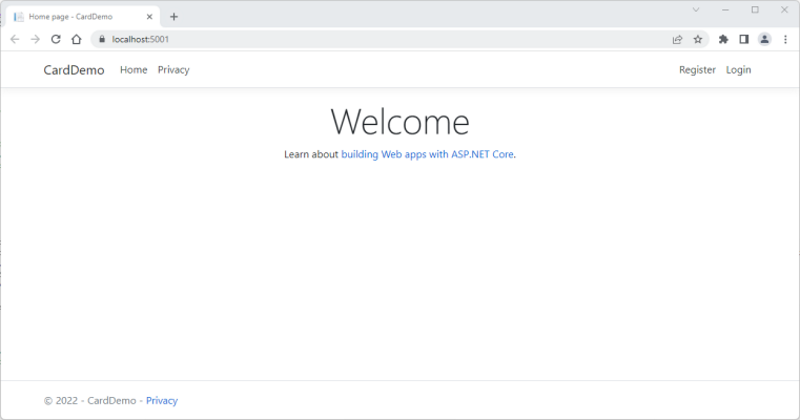

# ID Card Demo

>**NOTE** - This demo uses .NET Core 3.1. While .NET 6 has superceded .NET Core 3.1, and .NET Core 3.1 end-of-support date is December 13, 2022, we will use it, since not all servers support .NET 6 yet.

>**NOTE** - This is a customization of the instructions found at https://docs.microsoft.com/en-us/aspnet/core/tutorials/razor-pages/razor-pages-start?view=aspnetcore-3.1&tabs=visual-studio-code.

## Setup

Open a Windows Terminal and ensure the latest version of .NET Core SDK 3.1, is installed:

```
dotnet --list-sdks
```

If not, download the latest version of .NET Core SDK 3.1 from https://dotnet.microsoft.com/en-us/download/dotnet/3.1

Enter the following commands to create a Razor web application that uses .NET Core 3.1 and individual authentication:

**NOTE** - For portability, we will use individual authentication, which stores and manages user accounts in-app, instead of using an external authentication system, such as Windows Authentication or Azure Active Directory.

```
cd C:\Users\Rob\source\repos
dotnet new webapp --output IDCardDemo --framework netcoreapp3.1 --auth Individual
cd IDCardDemo
dotnet new sln
dotnet sln add IDCardDemo.csproj
```

Verify you added the project to the solution and look at the file listing:

```
dotnet sln list
ls
```

Generate a self-signed TLS certificate to use during development. Click **Yes** if any popup warnings appear:

```
dotnet dev-certs https --clean
dotnet dev-certs https --trust
```

Once again, for portability, I am using the **SQLite** database. To use SQLite, run the following commands:

```
dotnet remove package Microsoft.Data.Sqlite
dotnet add package Microsoft.Data.Sqlite --framework netcoreapp3.1
dotnet add package SQLitePCLRaw.bundle_e_sqlcipher --framework netcoreapp3.1
dotnet add package Microsoft.EntityFrameworkCore --version=3.*
dotnet add package Microsoft.EntityFrameworkCore.Sqlite --version=3.*
```

Add the **Entity Framework**, as well as the tools and packages needed for scaffolding:

```
dotnet tool install --global dotnet-ef --framework netcoreapp3.1
dotnet tool install --global dotnet-aspnet-codegenerator --framework netcoreapp3.1
dotnet add package Microsoft.VisualStudio.Web.CodeGeneration.Design --version 3.1.5
dotnet add package Microsoft.EntityFrameworkCore.Design --version=3.*
dotnet add package Microsoft.AspNetCore.Diagnostics.EntityFrameworkCore --version=3.1.*
dotnet add package Microsoft.Extensions.Logging.Debug --framework netcoreapp3.1
```

Add packages to support image manipulation and PDF creation:

```
dotnet add package System.Drawing.Common --framework netcoreapp3.1
dotnet add package PdfSharp
```

Build the solution:

```
dotnet build
```

Ensure that the messages ```build succeeded``` and ```0 Error(s)``` appear.

**NOTE** - You can safely ignore any warnings about PDFSharp. PDFSharp works with both the older .NET 4 framework and .NET Core 3.1.

Ensure the **Target Framework** is ```netcoreapp3.1```:

```
Select-String -Path "IDCardDemo.csproj" -Pattern "TargetFramework"
```

Using Visual Studio, Visual Studio Code, or an editor or IDE of your choice, open *Startup.cs*, and, in the ```ConfigureServices()``` method and, if the code exists, replace:

```
services.AddDbContext<ApplicationDbContext>(options =>
	options.UseSqlServer(Configuration.GetConnectionString("DefaultConnection")));
```

with...

```
services.AddDbContext<ApplicationDbContext>(options =>
	options.UseSqlite(Configuration.GetConnectionString("DefaultConnection")));
```

In addition, open *appsettings.json*, and, under ```ConnectionStrings``` and, if the code exists, replace:

```"DefaultConnection": "Server=(localdb)\\mssqllocaldb;Database=DefaultConnection-b15b26cc-20ff-42ee-af0a-1984535d6682;Trusted_Connection=True;MultipleActiveResultSets=true"```

with...

```"DefaultConnection": "Data Source=./holder.db;Password=<a password of your choice>"```

**NOTE** - The DefaultConnection string may be followed by a different alphanumeric set.

Return to the application's home directory:

```
cd C:\Users\Rob\source\repos\IDCardDemo
```

Start the app using IIS:

```
dotnet clean
dotnet build
dotnet run
```

Open a browser and navigate to http://localhost:5000/ (or https://localhost:5001):



When finished, close the browser, then press [Ctrl]+[C] to continue.

-----

## Add a Model

Return to the application's home directory:

```
cd C:\Users\Rob\source\repos\IDCardDemo
```

Create a directory named ```Models``` and navigate to it:

```
mkdir Models
cd Models
```

Using Visual Studio, Visual Studio Code, or an editor or IDE of your choice, create a class named *Holder.cs*, and enter the following code:

```
using System;
using System.ComponentModel.DataAnnotations;

namespace IDCardDemo.Models
{
    public class Holder
    {
        public int ID { get; set; }
        public string LastName { get; set; }
		public string FirstName { get; set; }
		public string MI { get; set; }
		[DataType(DataType.Date)]
		public DateTime DOB { get; set; }
		public string Gender { get; set; }
		public string Height { get; set; }
		public string EyeColor { get; set; }
    }
}
```

Save the file and navigate to the ```Data``` directory:

```
cd ..
cd Data
```

Create a class named *IDCardDemoContext.cs*, and enter the following code:

```
using Microsoft.EntityFrameworkCore;

namespace IDCardDemo.Data
{
    public class IDCardDemoContext : DbContext
    {
        public IDCardDemoContext (
            DbContextOptions<IDCardDemoContext> options)
            : base(options)
        {
        }

        public DbSet<IDCardDemo.Models.Holder> Holder { get; set; }
    }
}
```

Save the file and go back to the root directory:

```cd ..```

Add the database connection string, ```"IDCardDemoContext": "Data Source=Holders.db"```, to *appsettings.json* and save the file:

```
  "ConnectionStrings": {
    "DefaultConnection": "DataSource=app.db",
	"IDCardDemoContext": "Data Source=Holders.db"
  },
```

Modify the ```ConfigureServices``` method in *Startup.cs* and save the file:

```
        public void ConfigureServices(IServiceCollection services)
        {
            services.AddDbContext<ApplicationDbContext>(options =>
                options.UseSqlite(
                    Configuration.GetConnectionString("DefaultConnection")));
			services.AddDbContext<IDCardDemoContext>(options =>
                options.UseSqlite(Configuration.GetConnectionString("IDCardDemoContext")));
```

Build the project to verify there are no compilation errors.

```
dotnet build
```

Open *Holder.cs*, and add input validation and pre-storage actions:

```
        public int ID { get; set; }

        private string _lastName;
        [Display(Name = "Last Name")]
        // First character must be a letter
        // Middle characters must be letters, numbers, spaces, apostrophes, dashes, or periods
        // e.g., O'Brien, Smith-Jones, J.T., etc.
        // Last character must be alphanumeric
        // Minimum two characters, maximum 255 characters
        [RegularExpression(@"^([A-Za-z]{1})([ \'\-.0-9A-Za-z]{0,253})([0-9A-Za-z.]{1})$", ErrorMessage = "Letters, numbers, spaces, apostrophes, dashes, and periods only.")]
        [Required(ErrorMessage = "{0} required.")]
        [StringLength(255, ErrorMessage = "{0} must be between {2} and {1} characters long.", MinimumLength = 2)]

        public string LastName
        {
            get { return _lastName; }
            // Convert to uppercase before storing
            set { _lastName = !String.IsNullOrEmpty(value) ? value.ToUpper() : value; }
        }

        private string _firstName;
        [Display(Name = "First Name")]
        // First character must be a letter
        // Middle characters must be letters, numbers, spaces, apostrophes, dashes, or periods
        // e.g., O'Brien, Smith-Jones, J.T., etc.
        // Last character must be alphanumeric
        // Minimum two characters, maximum 127 characters
        [RegularExpression(@"^([A-Za-z]{1})([ \'\-.0-9A-Za-z]{0,125})([0-9A-Za-z.]{1})$", ErrorMessage = "Letters, numbers, spaces, apostrophes, dashes, and periods only.")]
        [Required(ErrorMessage = "{0} required.")]
        [StringLength(127, ErrorMessage = "{0} must be between {2} and {1} characters long.", MinimumLength = 2)]
        public string FirstName
        {
            get { return _firstName; }
            // Convert to uppercase before storing
            set { _firstName = !String.IsNullOrEmpty(value) ? value.ToUpper() : value; }
        }

        private string _mi;
        [Display(Name = "MI")]
        [RegularExpression(@"^[A-Z]{0,1}$", ErrorMessage = "Must be a capital letter.")]
        [StringLength(1, ErrorMessage = "Middle Initial can only be one letter long.")]
#nullable enable
        public string? MI
        {
            get { return _mi; }
            // Convert to uppercase before storing
            set { _mi = !String.IsNullOrEmpty(value) ? value.ToUpper() : value; }
        }
#nullable disable

        [DataType(DataType.Date)]
        [Display(Name = "DOB")]
        [DisplayFormat(DataFormatString = "{0:yyyy-MM-dd}", ApplyFormatInEditMode = true)]
        [Required(ErrorMessage = "Date of Birth required.")]
        public DateTime DOB { get; set; }

        [Display(Name = "Sex")]
        [RegularExpression(@"^[MFN]{1}$", ErrorMessage = "Invalid Gender.")]
        [Required(ErrorMessage = "Gender required.")]
        [StringLength(1, ErrorMessage = "Gender can only be one letter long.")]
        public string Gender { get; set; }

        [Display(Name = "HT")]
        [Range(24, 96, ErrorMessage = "Value for {0} must be between {1} and {2}.")]
        [Required(ErrorMessage = "Height (in inches) required.")]
        public string Height { get; set; }

        [Display(Name = "Eyes")]
        [RegularExpression("BLK|BLU|BRO|GRY|GRN|HAZ|MAR|MUL|PMK|UNK", ErrorMessage = "Invalid Eye Color")]
        [Required(ErrorMessage = "Eye Color required.")]
        public string EyeColor { get; set; }
```


Download Szymon Nowak's excellent Signature Pad JavaScript library:

```
cd wwwroot\js
Invoke-WebRequest https://cdn.jsdelivr.net/npm/signature_pad@2.3.2/dist/signature_pad.min.js -OutFile signature_pad.min.js
ls
```


Applicant/Member - Create, Read, and Update (own info)
Login
Create
Details
Edit

Officer (SFD only) - Own info, and Read and Print All
Login
Index
Read
Print

Manager - Own info, and Create, Read, Update, Delete, and Print All
Login
Index
Create
Details
Edit
Delete
Print

Administrator - Own info, CRUD-P, and, and Role administration