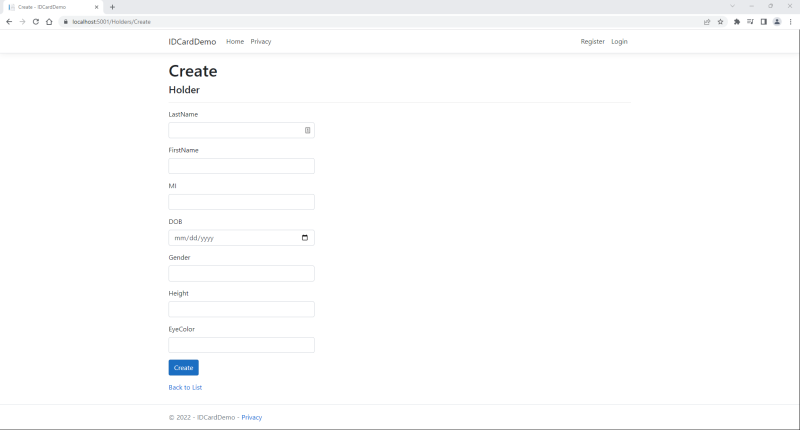
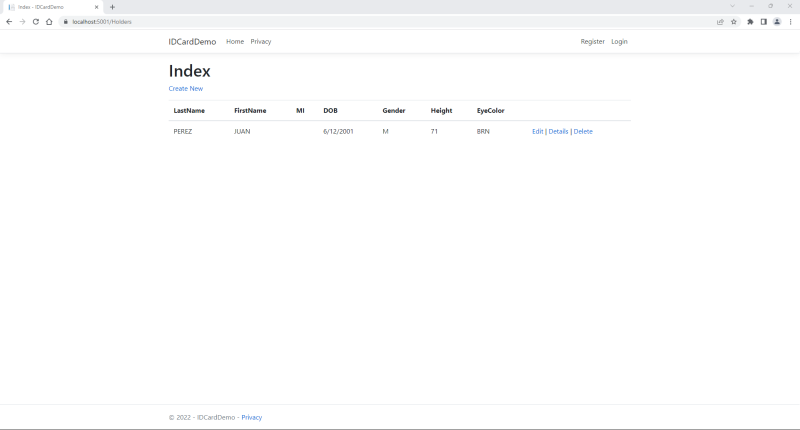
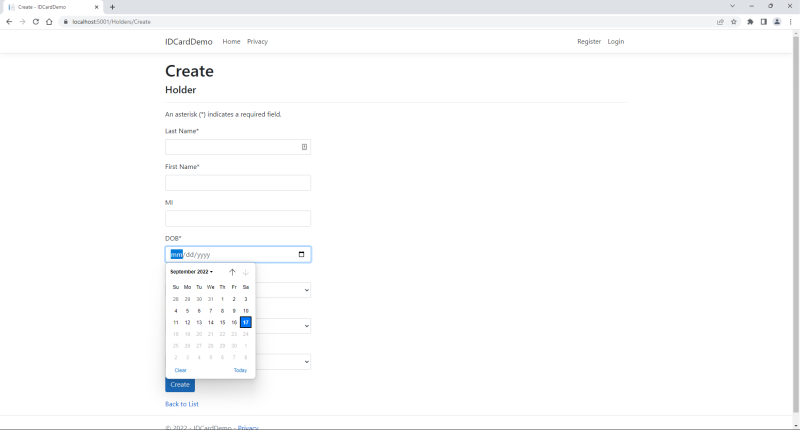

# ID Card Demo

```
## Setup
## Add a Model
## Add Card Holder Administration Pages
## Add Validation
## Customize Input Elements
## Add Links to Main Page
## Add JavaScript
## Add New Fields to the Model
## Update the Card Holder Pages
### Create
### Edit
### Details
### Delete
## Add CSS
## Test the Photo and Signature Code
## Add Printing
```

>**NOTE** - This demo uses .NET Core 3.1. While .NET 6 has superceded .NET Core 3.1, and .NET Core 3.1 end-of-support date is December 13, 2022, you will use it, since not all servers support .NET 6 yet.

>**NOTE** - This is a customization of the instructions found at https://docs.microsoft.com/en-us/aspnet/core/tutorials/razor-pages/razor-pages-start?view=aspnetcore-3.1&tabs=visual-studio-code.

## Setup

Open a Windows Terminal and ensure the latest version of .NET Core SDK 3.1, is installed:

```
dotnet --list-sdks
```

If not, download the latest version of .NET Core SDK 3.1 from https://dotnet.microsoft.com/en-us/download/dotnet/3.1

Enter the following commands to create a Razor web application that uses .NET Core 3.1 and individual authentication:

**NOTE** - For portability, you will use individual authentication, which stores and manages user accounts in-app, instead of using an external authentication system, such as Windows Authentication or Azure Active Directory.

```
cd C:\Users\Rob\source\repos
dotnet new webapp --output IDCardDemo --framework netcoreapp3.1 --auth Individual
cd IDCardDemo
dotnet new sln
dotnet sln add IDCardDemo.csproj
```

Verify you added the project to the solution and look at the file listing:

```
dotnet sln list
dir
```

Generate a self-signed TLS certificate to use during development. Click **Yes** if any popup warnings appear:

```
dotnet dev-certs https --clean
dotnet dev-certs https --trust
```

Once again, for portability, I am using a **SQLite** database. To use SQLite, run the following commands:

```
dotnet remove package Microsoft.Data.Sqlite
dotnet add package Microsoft.Data.Sqlite --framework netcoreapp3.1
dotnet add package SQLitePCLRaw.bundle_e_sqlcipher --framework netcoreapp3.1
dotnet add package Microsoft.EntityFrameworkCore --version=3.*
dotnet add package Microsoft.EntityFrameworkCore.Sqlite --version=3.*
```

Add the **Entity Framework**, as well as the tools and packages needed for scaffolding:

```
dotnet tool install --global dotnet-ef --framework netcoreapp3.1
dotnet tool install --global dotnet-aspnet-codegenerator --framework netcoreapp3.1
dotnet add package Microsoft.VisualStudio.Web.CodeGeneration.Design --version 3.1.5
dotnet add package Microsoft.EntityFrameworkCore.Design --version=3.*
dotnet add package Microsoft.AspNetCore.Diagnostics.EntityFrameworkCore --version=3.1.*
dotnet add package Microsoft.Extensions.Logging.Debug --framework netcoreapp3.1
```

Add packages to support image manipulation and PDF creation:

```
dotnet add package System.Drawing.Common --framework netcoreapp3.1
dotnet add package PdfSharp
dotnet add package ZXing.Net
```

Build the solution:

```
dotnet build
```

Ensure the ```build succeeded```, with ```0 Error(s)```.

**NOTE** - You can safely ignore any warnings about PDFSharp. PDFSharp works with both the older .NET 4 framework and .NET Core 3.1.

Ensure the **Target Framework** is ```netcoreapp3.1```:

```
Select-String -Path "IDCardDemo.csproj" -Pattern "TargetFramework"
```

Next, ensure you are in the application's home directory:

```
cd C:\Users\Rob\source\repos\IDCardDemo
```

This web application uses several databases. The default database file, ```app.db```, holds information about who can log into the site, such as administrators and site managers. However, in order to update the database, these users must have permission to read and write to the database file and its parent directory. Since the root directory does not allow this, and the EntityFramework cannot create directories using the SQLite provider, create a sub-directory named ```App_Data``` in the ```IDCardDemo``` root directory to hold the database file:

```
mkdir App_Data
```

Look for ```app.db```:

```
dir app.db
```

If the database file already exists, move it to the ```App_Data``` directory:

```
move app.db App_Data
```

**NOTE** - Do not worry if ```app.db``` does not exist yet. The following steps will ensure the database file is written to ```App_Data```.

Using Visual Studio, Visual Studio Code, or an editor or IDE of your choice, open the ```Startup.cs``` file. In the ```ConfigureServices()``` method, replace:

```
services.AddDbContext<ApplicationDbContext>(options =>
    options.UseSqlServer(Configuration.GetConnectionString("DefaultConnection")));
```

with...

```
string appDBSource = System.IO.Path.Combine(System.IO.Directory.GetCurrentDirectory(), @"App_Data\app.db");
services.AddDbContext<ApplicationDbContext>(options => 
    options.UseSqlite(string.Format("DataSource={0}", appDBSource)));
```

**NOTE** - If the code does not exist, add the replacement code to the method.

**NOTE** - By calling ```Directory.GetCurrentDirectory()``` and ```Path.Combine``` methods, you ensure that the server looks for the database file in the correct directory.

**NOTE** - If you want to encrypt the database, add the ```password``` keyword argument to the ```option``` command:

```
options.UseSqlite(string.Format("DataSource={0};Password=<a password of your choice>", dataSource)));
```

In addition, open ```appsettings.json```, and remove the ```ConnectionStrings``` node, if it exists.

Start the app using IIS:

```
dotnet clean
dotnet build
dotnet run
```

Open a browser and navigate to http://localhost:5000/ (or https://localhost:5001):


When finished, close the browser, then press [Ctrl]+[C] to continue.

-----

## Add a Model

Return to the application's home directory:

```
cd C:\Users\Rob\source\repos\IDCardDemo
```

Create a directory named ```Models``` and navigate to it:

```
mkdir Models
cd Models
```

Using Visual Studio, Visual Studio Code, or an editor or IDE of your choice, create a class named ```Holder.cs```, and enter the following code:

```
using System;
using System.ComponentModel.DataAnnotations;

namespace IDCardDemo.Models
{
    public class Holder
    {
    public int ID { get; set; }
    public string LastName { get; set; }
        public string FirstName { get; set; }
        public string MI { get; set; }
        [DataType(DataType.Date)]
        public DateTime DOB { get; set; }
        public string Gender { get; set; }
        public string Height { get; set; }
        public string EyeColor { get; set; }
    }
}
```

Save the file and navigate to the ```Data``` directory:

```
cd ..
cd Data
```

Create a class named ```IDCardDemoContext.cs```, and enter the following code:

```
using Microsoft.EntityFrameworkCore;

namespace IDCardDemo.Data
{
    public class IDCardDemoContext : DbContext
    {
        public IDCardDemoContext (
            DbContextOptions<IDCardDemoContext> options)
            : base(options)
        {
        }

        public DbSet<IDCardDemo.Models.Holder> Holder { get; set; }
    }
}
```

Save the file and go back to the root directory:

```cd ..```

Using Visual Studio, Visual Studio Code, or an editor or IDE of your choice, open the ```Startup.cs``` file. In the ```ConfigureServices()``` method, add the following lines:

```
string holdersDBSource = System.IO.Path.Combine(System.IO.Directory.GetCurrentDirectory(), @"App_Data\Holders.db");
services.AddDbContext<IDCardDemoContext>(options => 
    options.UseSqlite(string.Format("DataSource={0}", holdersDBSource)));
```

**NOTE** - If you want to encrypt the database, add the ```password``` keyword argument to the ```option``` command:

```
options.UseSqlite(string.Format("DataSource={0};Password=<a password of your choice>", dataSource)));
```

Build the project to verify there are no compilation errors.

```
dotnet build
```

-----

## Add Card Holder Administration Pages

.NET can "scaffold" the pages and code you need to create, read, update, and delete (CRUD) records. Enter the following command:

```
# dotnet-aspnet-codegenerator razorpage --model Holder --dataContext IDCardDemoContext --useDefaultLayout  --useSqlite -outDir Pages\Holders --referenceScriptLibraries
dotnet-aspnet-codegenerator razorpage -m Holder -dc IDCardDemoContext -udl -sqlite -outDir Pages\Holders --referenceScriptLibraries
```

Create the initial database schema, based on the data types and information in the *Holder* model:

```
# dotnet ef migrations add --context IDCardDemoContext InitialCreate
dotnet ef migrations add -c IDCardDemoContext InitialCreate
# dotnet ef database update --context IDCardDemoContext
dotnet ef database update -c IDCardDemoContext
```

This is called a ***migration***. Anytime you update the *Holder* class, you should perform a migration to update the database schema, as well.

Start the app using IIS:

```
dotnet clean
dotnet build
dotnet run
```

Open a browser and navigate to http://localhost:5001/Holders/Create (or https://localhost:5001/Holders/Create):



Fill in the text boxes and add a holder:

**NOTE** - Enter everything in upper case, to keep the database uniform. Later, you will add a property to ensure data is stored in uppercase, regardless of the way it was entered.


Once you click on **Create**, you will be redirected to a list of holders:


Click on **Details** to see information about the holder:


Click on **Edit** and update the holder's height to 71 inches:


Click on **Save**. Back at the **Index**, you will notice the holder's height has been updated:



Click on **Delete**:


Once you click on **Delete**, you will be redirected to an empty list of holders:


When finished, close the browser, then press [Ctrl]+[C] to continue.

-----

## Add Validation

Creating the database, the schema, and the database entry pages used to take a long time. Today, migrations and scaffolding take care of much of the work for you. However, you can still customize the schema and pages to suit your needs.

For example, if you look at the list of card holders again, you will notice that there is no space between **LastName**, **FirstName**, and **EyeColor**. You cannot separate "Last" and "Name" in the code, but you can use ***Data Annotations*** to add a space when displayed:

```
[Display(Name = "Last Name")]
public string LastName { get; set; }
```

You can also add other annotations to validate input, such as making an input required, or preventing command and SQL injections, allowing only letters, spaces, apostrophes, dashes, and periods, or setting a maximum length:

**NOTE** - These regular expression validators are very simple and can be customize further to enforce format, etc.

**NOTE** - ID cards have a limited amount of space for text, so limit the strings to a reasonable length (e.g., 32 characters).

```
[Display(Name = "Last Name")]
[RegularExpression(@"^([A-Za-z])([ '\-.A-Za-z]*)([A-Za-z])(\.?)$", ErrorMessage = "Letters, spaces, apostrophes, dashes, and periods only.")]
[Required(ErrorMessage = "{0} required.")]
[StringLength(32, ErrorMessage = "{0} must be between {2} and {1} characters long.", MinimumLength = 1)]
public string LastName { get; set; }
```

You can also add a backing field for a property that will convert input into uppercase before storing it in the database:

```
private string _lastName;
[Display(Name = "Last Name")]
[RegularExpression(@"^([A-Za-z])([ '\-.A-Za-z]*)([A-Za-z])(\.?)$", ErrorMessage = "Letters, spaces, apostrophes, dashes, and periods only.")]
[Required(ErrorMessage = "{0} required.")]
[StringLength(32, ErrorMessage = "{0} must be between {2} and {1} characters long.", MinimumLength = 1)]
public string LastName {
    get { _lastName; }
    // Convert to uppercase before storing
    set { _lastName = !String.IsNullOrEmpty(value) ? value.ToUpper() : value; }
}
```

Therefore, navigate to the ```Models``` directory:

```cd Models```

Using Visual Studio, Visual Studio Code, or an editor or IDE of your choice, open the ```Holder.cs``` file, and update the properties:

```
/// <summary>
/// <value>Property <c>ID</c> is the card holder's unique identifier.</value>
/// </summary>
public int ID { get; set; }

/// <summary>
/// <value>Property <c>LastName</c> is required; can contain letters, spaces, apostrophes, dashes, and periods only; and must be less than 32 characters in length.</value>
/// </summary>
private string _lastName;
[Display(Name = "Last Name")]
[Required(ErrorMessage = "{0} required.")]
[RegularExpression(@"^([A-Za-z])([ '\-.A-Za-z]*)([A-Za-z])(\.?)$", ErrorMessage = "Letters, spaces, apostrophes, dashes, and periods only.")]
[StringLength(32, MinimumLength = 2, ErrorMessage = "{0} must be between {2} and {1} characters long.")]
public string LastName {
	get => _lastName;
	// Convert to uppercase before storing
	set => _lastName = !String.IsNullOrEmpty(value) ? value.ToUpper() : value;
}

/// <summary>
/// <value>Property <c>FirstName</c> is required; can contain letters, spaces, apostrophes, dashes, and periods only; and must be less than 32 characters in length.</value>
/// </summary>
private string _firstName;
[Display(Name = "First Name")]
[Required(ErrorMessage = "{0} required.")]
[RegularExpression(@"^([A-Za-z])([ '\-.A-Za-z]*)([A-Za-z])(\.?)$", ErrorMessage = "Letters, spaces, apostrophes, dashes, and periods only.")]
[StringLength(32, MinimumLength = 2, ErrorMessage = "{0} must be between {2} and {1} characters long.")]
public string FirstName {
	get => _firstName;
	// Convert to uppercase before storing
	set => _firstName = !String.IsNullOrEmpty(value) ? value.ToUpper() : value;
}

/// <summary>
/// <value>Property <c>Middle Initial</c> is not required, but if present, it must be a single capital letter.</value>
/// </summary>
private string _mi;
[Display(Name = "MI")]
[RegularExpression(@"^[A-Z]?$", ErrorMessage = "Middle Initial must be a capital letter.")]
[StringLength(1, MinimumLength = 0, ErrorMessage = "Middle Initial must be between {2} and {1} characters long.")]
#nullable enable
public string? MI {
	get => _mi;
	// Convert to uppercase before storing
	set => _mi = !String.IsNullOrEmpty(value) ? value.ToUpper() : value;
}
#nullable disable

/// <summary>
/// <value>Property <c>DOB</c> is required, and must be in yyyy-MM-dd format (e.g., 2001-06-12).</value>
/// </summary>
[DataType(DataType.Date)]
[Display(Name = "DOB")]
[DisplayFormat(DataFormatString = "{0:yyyy-MM-dd}", ApplyFormatInEditMode = true)]
[Required(ErrorMessage = "Date of Birth required.")]
[NoFutureDOB(ErrorMessage="Date of Birth cannot be in the future.")]
public DateTime DOB { get; set; }

/// <summary>
/// <value>Property <c>Gender</c> is required and must be a capital letter 'M', 'F', or 'N'.</value>
/// </summary>
[Display(Name = "Sex")]
[RegularExpression(@"^[MFN]$", ErrorMessage = "Invalid Gender.")]
[Required(ErrorMessage = "Gender required.")]
public string Gender { get; set; }

/// <summary>
/// <value>Property <c>Height</c> is required and must be an integer between 24 and 96.</value>
/// </summary>
[Display(Name = "HT")]
[Range(24, 96, ErrorMessage = "Height must be between {1} and {2} inches.")]
[Required(ErrorMessage = "Height (in inches) required.")]
public string Height { get; set; }

/// <summary>
/// <value>Property <c>EyeColor</c> is required and must be 'BLK', 'BLU', 'BRO', 'GRY', 'GRN', 'HAZ', 'MAR', 'MUL', 'PMK', or 'UNK'.</value>
/// </summary>
[Display(Name = "Eyes")]
[RegularExpression("BLK|BLU|BRO|GRY|GRN|HAZ|MAR|MUL|PMK|UNK", ErrorMessage = "Invalid Eye Color")]
[Required(ErrorMessage = "Eye Color required.")]
public string EyeColor { get; set; }
```

> **NOTE** - Since this is the actual schema you will use for the application, you should update the database. Unfortunately, SQLite does not allow you to alter column size through migration. Since you are just starting, delete the database and reapply the initial migration:
>
> ```
> cd ..
> del App_Data/Holders.db
> dotnet ef database update 0 -c IDCardDemoContext
> dotnet ef migrations remove -c IDCardDemoContext
> dotnet ef migrations add -c IDCardDemoContext InitialCreate
> dotnet ef database update -c IDCardDemoContext
> ```
>
> See also: https://learn.microsoft.com/en-us/ef/core/providers/sqlite/limitations


This takes care of validation on the server side, but what about validation on the client side? Actually, when you compile abd deploy the web application, the validation annotations are added to the input elements, such as text boxes, etc.

Start the app using IIS:

```
dotnet clean
dotnet build
dotnet run
```

Open a browser and navigate to http://localhost:5001/Holders/Create (or https://localhost:5001/Holders/Create).

First, notice that your desired display names appear; there is now a space between "Last" and "Name"!

Next, enter a number in the **Last Name**, and then press <kbd>Tab</kbd>:


Your warning, "Letters, spaces, apostrophes, dashes, and periods only.", appears. If you attempt you enter invalid input in any of the other text boxes, your warnings will also appear.

-----

## Customize Input Elements

However, you can improve the user's experience by indicting which fields are required and adding dropdown lists, so they do not have to guess what to enter.

Access the ```Pages\Holders``` directory:

```
cd Pages\Holders
```

Using Visual Studio, Visual Studio Code, or an editor or IDE of your choice, open the ```Create.cshtml``` and ```Create.cshtml.cs``` files.

In ```Create.cshtml```, add the following line above ```<form method="post">```:

```<p>An asterisk (*) indicates a required field.</p>```

Add an asterisk after each label, except for ```Holder.MI```:

```
<label asp-for="Holder.LastName" class="control-label"></label>*
```

Start the app using IIS:

```
dotnet clean
dotnet build
dotnet run
```

Open a browser and navigate to http://localhost:5001/Holders/Create (or https://localhost:5001/Holders/Create).


The required field indicators appear.

Next, add a dropdown list to **Gender**, by replacing...

```<input asp-for="Holder.Gender" class="form-control" />```

with...

```
<select asp-for="Holder.Gender" class="form-control">
    <option value="M">M</option>
    <option value="F">F</option>
    <option value="N">N</option>
</select>
```

To do the same thing with height and eye color may be impractical, since they have so many values. Therefore, you will have the code behind add them dynamically.

Add a dropdown list to **Height** and **EyeColor**, by replacing...

```<input asp-for="Holder.Height" class="form-control" />```
and
```<input asp-for="Holder.EyeColor" class="form-control" />```

with...

```<select asp-for="Holder.Height" asp-items="Model.Heights" class="form-control"></select>```
and
```<select asp-for="Holder.EyeColor" asp-items="Model.EyeColor" class="form-control"></select>```

In ```Create.cshtml.cs```, replace the **```CreateModel```** method with the following:

```
// References to the HTML elements populated from the code-behind using loops, etc.
public IEnumerable<SelectListItem> Heights { get; set; }
public IEnumerable<SelectListItem> EyeColor { get; set; }

public CreateModel(IDCardDemo.Data.IDCardDemoContext context)
{
    _context = context;

    // Use loops to populate large dropdown lists
    Heights = Enumerable.Range(24, 96).Select(x => new SelectListItem
    {
        Value = x.ToString(),
        Text = String.Format("{0}\" ({1}\' {2}\")", x, (int)x / 12, x % 12),
        Selected = x == 64,
    });

    Dictionary<string, string> EyeColorDict = new Dictionary<string, string>() {
        { "BLK", "Black" },
        { "BLU", "Blue" },
        { "BRO", "Brown" },
        { "GRY", "Grey" },
        { "GRN", "Green" },
        { "HAZ", "Hazel" },
        { "MAR", "Maroon" },
        { "MUL", "Multicolor" },
        { "PNK", "Pink" },
        { "UNK", "Unknown" }
    };

    EyeColor = new SelectList(EyeColorDict, "Key", "Value");
}
```

Start the app using IIS:

```
dotnet clean
dotnet build
dotnet run
```

Open a browser and navigate to http://localhost:5001/Holders/Create (or https://localhost:5001/Holders/Create).


The dropdown lists appear.

While you are here, click on the calendar in the **DOB** textbox. You will notice that you can be born in the future!

To prevent a card holder from entering a future date of birth, in ```Create.cshtml```, replace...

```<input asp-for="Holder.DOB" class="form-control" />```

with...

```<input type="date" max='@DateTime.Now.ToString("yyyy-MM-dd")' asp-for="Holder.DOB" class="form-control" />```

On the server-side, create a custom validator to prevent future dates. Using Visual Studio, Visual Studio Code, or an editor or IDE of your choice, open the ```Holder.cs``` file.

Add the following class to ```IDCardDemo.Models``` (after the ```Holder``` class):

```
public class NoFutureDOB : ValidationAttribute
{
    public override bool IsValid(object value)
    {
        var dateValue = value as DateTime? ?? new DateTime();
        if (dateValue.Date > DateTime.Now.Date)
        {
            return false;
        }
        return true;
    }
}
```

Add a data annotation to the **DOB** property:

```
[NoFutureDOB(ErrorMessage="DOB cannot be in the future.")]
public DateTime DOB { get; set; }
```

Start the app using IIS:

```
dotnet clean
dotnet build
dotnet run
```

Open a browser and navigate to http://localhost:5001/Holders/Create (or https://localhost:5001/Holders/Create).

When you use the calendar, the future dates are greyed-out, and cannot be selected:



If you try to type in the future date, you also receive an error:


***IMPORTANT!***

Do not forget to make the same changes you made to **Create** to ```Edit.cshtml``` and ```Edit.cshtml.cs```! Substitute ```EditModel``` for ```CreateModel```:

```
// References to the HTML elements populated from the code-behind using loops, etc.
public IEnumerable<SelectListItem> Heights { get; set; }
public IEnumerable<SelectListItem> EyeColor { get; set; }

public EditModel(IDCardDemo.Data.IDCardDemoContext context)
{
    ...
```

Add a new car holder, as you did before, then edit the entry. The edit page inputs should be the same as the create page inputs, and the warnings should be the same:


-----

## Add Links to Main Page

By the way, having to enter the ```Create``` or ```Index``` URLs, each time you need to make a change or look at a list of card holders, can get annoying. Save the files and go to the **Pages** directory:

```
cd Pages
```

Using Visual Studio, Visual Studio Code, or an editor or IDE of your choice, open the ```Index.cshtml``` file. Add the following lines after the last line on the page:

```
<div>
    <a asp-page="/Holders/Create">Add a Holder</a>
    <br />
    <a asp-page="/Holders/Index">List Holders</a>
</div>
```

You may have noticed that instead of ```href```, you used ```asp-page```. Using **Razor tag helpers**, instead of regular HTML tags, take care of many things, such as correct routing, etc.

Start the app using IIS:

```
dotnet clean
dotnet build
dotnet run
```

Open a browser and navigate to http://localhost:5001/Holders (or https://localhost:5001/Holders).


-----

## Add JavaScript

You still need to add some items to the ID card, such as a signature and a photo. To do complete these tasks, you will use JavaScript.

Go to the ```wwwroot``` directory and create the sub-directories you will need:

```
cd wwwroot
mkdir photos
mkdir temp
mkdir images
```

In the ```wwwroot``` directory, go to the JavaScript sub-directory:

**NOTE** - When you eventually deploy your web application, **```wwwroot```** will be the *accessible* part of your site, where you can store files. All your other code, with the exception of ```App_Data```, will be compiled into a single executable file, named ***idcardemo.exe***.

```cd wwwroot/js```

Download Szymon Nowak's excellent Signature Pad JavaScript program:

```
Invoke-WebRequest https://cdn.jsdelivr.net/npm/signature_pad@2.3.2/dist/signature_pad.min.js -OutFile signature_pad.min.js
```

In the same directory, using Visual Studio, Visual Studio Code, or an editor or IDE of your choice, create a file named ```signature.js```, and add the following code:

```
var pad = new SignaturePad(signatureCanvas);

async function clearPad() {
    try {
        signatureCanvas.getContext("2d").clearRect(0, 0, signatureCanvas.width, signatureCanvas.height);
        console.log("Signature pad cleared");
    } catch (err) {
        console.log("Cannot clear signature pad:" + err);
        alert("Cannot clear signature pad!")
    }
}

async function saveSignature() {
    try {
        // Get the raw image data from the data URL, but remove the metadata
        let imageData = signatureCanvas.toDataURL("image/png").replace("data:image/png;base64,", "");
        // Send the data, as a string, to the SaveSignature() handler in the code behind
        await $.ajax({
            type: "POST",
            url: "Create?handler=SaveSignature",
            data: JSON.stringify(imageData),
            contentType: "application/json",
            // Needed to allow the app to save files to wwwroot
            beforeSend: function (xhr) {
                xhr.setRequestHeader("XSRF-TOKEN",
                    $('input:hidden[name="__RequestVerificationToken"]').val());
            },
            success: function (msg) {
				console.log("Signature saved: " + msg);
                alert("Signature saved!");
            },
        });
    } catch (err) {
        console.log("Cannot save signature:" + err);
        alert("Cannot save signature!")
    }
}

async function updateSignature() {
    try {
        // Get the raw image data from the data URL, but remove the metadata
        let imageData = signatureCanvas.toDataURL("image/png").replace("data:image/png;base64,", "");
        // Send the data, as a string, to the UpdateSignature() handler in the code behind
        await $.ajax({
            type: "POST",
            url: "Edit?handler=UpdateSignature",
            data: JSON.stringify(imageData),
            contentType: "application/json",
            // Needed to allow the app to update files in wwwroot
            beforeSend: function (xhr) {
                xhr.setRequestHeader("XSRF-TOKEN",
                    $('input:hidden[name="__RequestVerificationToken"]').val());
            },
            success: function (msg) {
                console.log("Signature updated: " + msg);
                alert("Signature updated!");
            },
        });
    } catch (err) {
        console.log("Cannot update signature: " + err);
        alert("Cannot update signature!")
    }
}
```

In the same directory, create a file named ```photo.js``` and add the following code:

```
var cameraStatus = false;
var pictureTaken = false;

async function cameraOn() {
    try {
        // Stream video from the webcam
        let stream = await navigator.mediaDevices.getUserMedia({
            audio: false,
            video: { width: 300, height: 300, facingMode: 'user', },
        });
        webcamVideo.srcObject = stream;
        cameraStatus = true;
        console.log("Camera on.");
		alert("Camera on.");
    } catch (err) {
        cameraStatus = false;
        console.log("Cannot turn camera on: " + err);
        alert("Cannot turn camera on!")
    }
}

async function takePhoto() {
    try {
        if (cameraStatus) {
            // Capture the video input and display the photo in the photoCanvas
            photoCanvas.getContext("2d").drawImage(webcamVideo, 0, 0, photoCanvas.width, photoCanvas.height);
            pictureTaken = true;
            console.log("Picture taken.");
			alert("Picture taken.")
        }
        else {
            pictureTaken = false;
            console.log("Camera is not on!");
            alert("Camera is not on!")
        }
    } catch (err) {
        pictureTaken = false;
        console.log("Cannot take photo: " + err);
        alert("Cannot take photo!")
        cameraOff();
    }
}

async function savePhoto() {
    try {
        if (cameraStatus && pictureTaken) {
            // Get the raw image data from the data URL, but remove the metadata
            let imageData = photoCanvas.toDataURL("image/png").replace("data:image/png;base64,", "");
            // Send the data, as a string, to the SavePhoto() handler in the code behind
            await $.ajax({
                type: "POST",
                url: "Create?handler=SavePhoto",
                data: JSON.stringify(imageData),
                contentType: "application/json",
                // Needed to allow the app to save files to wwwroot
                beforeSend: function (xhr) {
                    xhr.setRequestHeader("XSRF-TOKEN",
                        $('input:hidden[name="__RequestVerificationToken"]').val());
                },
                success: function (msg) {
                    console.log("Photo saved: " + msg);
                    alert("Photo saved.");
                }
            });
            cameraOff();
			pictureTaken = false;
        }
        else {
            console.log("No picture taken!");
            alert("No picture taken!")
        }
    } catch (err) {
        console.log("Cannot save photo: " + err);
        alert("Cannot save photo!")
    }
}

async function updatePhoto() {
    try {
        if (cameraStatus && pictureTaken) {
            // Get the raw image data from the data URL, but remove the metadata
            let imageData = photoCanvas.toDataURL("image/png").replace("data:image/png;base64,", "");
            // Send the data, as a string, to the UpdatePhoto() handler in the code behind
            await $.ajax({
                type: "POST",
                url: "Edit?handler=UpdatePhoto",
                data: JSON.stringify(imageData),
                contentType: "application/json",
                // Needed to allow the app to update files in wwwroot
                beforeSend: function (xhr) {
                    xhr.setRequestHeader("XSRF-TOKEN",
                        $('input:hidden[name="__RequestVerificationToken"]').val());
                },
                success: function (msg) {
                    console.log("Photo updated: " + msg);
                    alert("Photo updated.");
                }
            });
            cameraOff();
            pictureTaken = false;
        }
        else {
            console.log("No picture taken!");
            alert("No picture taken!")
        }
    } catch (err) {
        console.log("Cannot update photo!");
        alert("Cannot update photo!")
    }
}

async function cameraOff() {
    try {
        if (cameraStatus) {
            // Turn off camera
            webcamVideo.pause();
            webcamVideo.src = "";
            webcamVideo.srcObject.getTracks()[0].stop();
        }
        cameraStatus = false;
        console.log("Camera off.");
		alert("Camera off.");
    } catch (err) {
        console.log("Cannot turn camera off!");
        alert("Cannot turn camera off!")
    }
}
```

## Add New Fields to the Model

**NOTE** - If you added any card holders, run the application and delete them before continuing.

Using Visual Studio, Visual Studio Code, or an editor or IDE of your choice, open the ```Holder.cs``` file, and add the following lines at the end of the **Holder** class:

```
/// <summary>
/// <value>Property <c>PhotoPath</c> holds the filepath to the card holder's photo on the server.</value>
/// </summary>
[Display(Name = "Photo")]
public string PhotoPath { get; set; }

/// <summary>
/// <value>Property <c>SignaturePath</c> holds the filepath to the card holder's signature on the server.</value>
/// </summary>
[Display(Name = "Signature")]
public string SignaturePath { get; set; }

/// <summary>
/// <value>Property <c>PDF417Path</c> holds the filepath, on the server, to the PDF-417 barcode generated for the card holder.</value>
/// </summary>
[Display(Name = "PDF-417")]
public string PDF417Path { get; set; }
```

Update the database:

**NOTE** - Since you are adding columns, but not altering them, you do not have to recreate the database.

```
dotnet ef migrations add -c IDCardDemoContext UpdateSchema
dotnet ef database update -c IDCardDemoContext
```

## Update the Card Holder Pages

**NOTE** - Here comes a lot of code! Save often!

Return to the root directory, and, using Visual Studio, Visual Studio Code, or an editor or IDE of your choice, open the ```Startup.cs``` file. In the ```ConfigureServices()``` method, add the following lines:

```
// Needed to allow the app to save files to the wwwroot
services.AddAntiforgery(o => o.HeaderName = "XSRF-TOKEN");
```

### Create

Navigate to ```Pages/Holders``` and open the ```Create.cshtml.cs``` file.

Import the following reference (at the top of the file):

```
using Microsoft.AspNetCore.Hosting;
using System.Drawing;
using System.IO;
using System.Text;
using ZXing;
```

Add the following instance variables to the class, and modify the ```CreateModel``` method's arguments:

```
// Status flags
private static bool photoUploaded = false;
private static bool signatureUploaded = false;
private static string status;

// Holds the root filepath of the web application; used for saves, etc.
private readonly IWebHostEnvironment _environment;

public CreateModel(IDCardDemo.Data.IDCardDemoContext context, IWebHostEnvironment environment)
{
    _context = context;
    _environment = environment;
```

Add the following two methods after the property binding (```public Holder Holder { get; set; }```):

```
// Method to save temp photo using Ajax
// Remember to prepend OnPost to method name
public JsonResult OnPostSavePhoto([FromBody] string imageData) {
	if (String.IsNullOrWhiteSpace(imageData)) return null;
	byte[] data = Convert.FromBase64String(imageData);
	string filepath = Path.Combine(_environment.ContentRootPath, "wwwroot\\temp", "temp_photo.png");
	System.IO.File.WriteAllBytes(filepath, data);
	Holder.PhotoPath = filepath;
	photoUploaded = true;
	return new JsonResult(filepath);
}

// Method to save temp signature using Ajax
// Remember to prepend OnPost to method name
public JsonResult OnPostSaveSignature([FromBody] string imageData) {
	if (String.IsNullOrWhiteSpace(imageData)) return null;
	byte[] data = Convert.FromBase64String(imageData);
	string filepath = Path.Combine(_environment.ContentRootPath, "wwwroot\\temp", "temp_signature.png");
	System.IO.File.WriteAllBytes(filepath, data);
	Holder.SignaturePath = filepath;
	signatureUploaded = true;
	return new JsonResult(filepath);
}
```

Change the code in the ```OnPostAsync``` method to the following:

```
public async Task<IActionResult> OnPostAsync() {
	try {
		if (!ModelState.IsValid || !photoUploaded || !signatureUploaded) {
			if (!photoUploaded || !signatureUploaded) {
				status = "Missing photo or signature!";
			}
			else {
				status = "Missing information!";
			}
			// Reset the flags and return the page with errors identified
			// The model validation fields will populate the error messages automatically
			photoUploaded = false;
			signatureUploaded = false;
			return Page();
		}

		// Create the filename prefix
		string fixedLastName = RemoveSpecialCharacters(Holder.LastName.ToLower());
		string fixedFirstName = RemoveSpecialCharacters(Holder.FirstName.ToLower());
		string timeStamp = DateTime.Now.ToString("yyyMMddHHmmss");
		string userFileName = String.Format("{0}_{1}_{2}", fixedLastName.ToLower(), fixedFirstName.ToLower(), timeStamp);

		// Copy the temp images to photo folder and rename them using the holder data
		string photoImagePath = Path.Combine(_environment.ContentRootPath, "wwwroot\\temp", "temp_photo.png");
		Holder.PhotoPath = String.Format("{0}_photo.png", userFileName);
		System.IO.File.Copy(photoImagePath, Path.Combine(_environment.ContentRootPath, "wwwroot\\photos", Holder.PhotoPath), true);

		string signatureImagePath = Path.Combine(_environment.ContentRootPath, "wwwroot\\temp", "temp_signature.png");
		Holder.SignaturePath = String.Format("{0}_sign.png", userFileName);
		System.IO.File.Copy(signatureImagePath, Path.Combine(_environment.ContentRootPath, "wwwroot\\photos", Holder.SignaturePath), true);

		// Prepare barcode info
		string memberInfo = String.Format("{0},{1},{2},{3},{4},{5},{6},{7}",
		 Holder.LastName.ToUpper(),
		 Holder.FirstName.ToUpper(),
		 String.IsNullOrEmpty(Holder.MI) ? "" : Holder.MI.ToUpper(),
		 "1 MAIN ST ANY TOWN MD 12345-0000",
		 Holder.DOB.ToString("MM/dd/yyyy"),
		 Holder.Gender.ToUpper(),
		 Holder.Height,
		 Holder.EyeColor);
		// Create and save barcode
		// http://stackoverflow.com/questions/13289742/zxing-net-encode-string-to-qr-code-in-cf //
		BarcodeWriter writer = new BarcodeWriter {
			Format = BarcodeFormat.PDF_417,
			Options = { Width = 342, Height = 100 },
		};
		Bitmap barcodeBitmap;
		writer.Options.Margin = 0;
		barcodeBitmap = writer.Write(memberInfo);
		Holder.PDF417Path = String.Format("{0}_code.png", userFileName);
		barcodeBitmap.Save(Path.Combine(_environment.ContentRootPath, "wwwroot\\photos", Holder.PDF417Path), System.Drawing.Imaging.ImageFormat.Png);
		barcodeBitmap.Dispose();

		_context.Holder.Add(Holder);
		await _context.SaveChangesAsync();

		int holderID = Holder.ID;
		ModelState.Clear();
		return RedirectToPage("./Details", new { id = holderID });
	}
	catch (Exception e) {
		status = String.Format("Could not add record: {0}", e);
		 return Page();
	}
	finally {
		ViewData["Status"] = status;
		photoUploaded = false;
		signatureUploaded = false;
	}
}
```

Add the following method after ```OnPostAsync```:

```
// Special thanks to Guffa http://stackoverflow.com/questions/1120198/most-efficient-way-to-remove-special-characters-from-string
public static string RemoveSpecialCharacters(string str) {
	StringBuilder sb = new StringBuilder();
	foreach (char c in str) {
		if ((c >= '0' && c <= '9') || (c >= 'A' && c <= 'Z') || (c >= 'a' && c <= 'z')) {
			sb.Append(c);
		}
	}
	return sb.ToString();
}
```

Open ```Create.cshtml```, and, right above ```<h1>Create</h1>```, add the following line:

```
@Html.AntiForgeryToken()
```

Right above ```<p>An asterisk (*) indicates a required field.</p>```, add the following line:

```
<h4 class="text-danger font-weight-bold font-weight-italic">@ViewData["Status"]</h4>
<h4>Fill out the form:</h4>
```

Replace...

```<form method="post">```

with...

```<form id="create" method="post">```

Near the bottom, replace everything after the last ```<div class="form-group">``` with:

```
        </form>
        <hr />
        <h4>Take a photo:</h4>
        <ol type="a">
            <li><button onclick="cameraOn()">Turn on the camera</button></li>
            <li>
                <p>Center your face in the screen below:</p>
                <div id="videoContainer">
                    <div id="box"></div>
                    <video id="webcamVideo" width="300" height="300" autoplay></video>
                </div>
            </li>
            <li><button onclick="takePhoto()">Take a photo</button></li>
            <li>
                <p>Review your photo:</p>
                <canvas id="photoCanvas" width="300" height="300"">
                    Your browser does not support the HTML5 canvas tag.
                </canvas>
            </li>
            <li><button onclick="savePhoto()">Accept the photo</button></li>
        </ol>
        <hr />
        <h4>Add a signature:</h4>
        <button onclick="clearPad()">Clear the box</button>
        <br />
        <canvas class="my-2" id="signatureCanvas" width="320" height="120">
            Your browser does not support the HTML5 canvas tag.
        </canvas>
        <br />
        <button onclick="saveSignature()">Accept the signature</button>
        <hr />
        <h4>Add Holder:</h4>
        <p class="p-2 bg-warning text-dark rounded">
            Before pressing <b>Add Holder</b>, ensure you have filled in all the required fields,
            and that you have accepted both a photo and signature. Otherwise, the page will reload,
            and you will have to submit another photo and signature.
        </p>
        <input type="submit" value="Add Holder" form="create" />
        <hr />
    </div>
</div>

<div>
    <a asp-page="Index">Back to List</a>
</div>

<script type="text/javascript" src="~/js/photo.js" asp-append-version="true"></script>
<script type="text/javascript" src="~/js/signature_pad.min.js" asp-append-version="true"></script>
<script type="text/javascript" src="~/js/signature.js" asp-append-version="true"></script>
@section Scripts {
    @{await Html.RenderPartialAsync("_ValidationScriptsPartial");}
}
```

### Edit

Open the ```Edit.cshtml.cs``` file.

Import the following reference (at the top of the file):

```
using Microsoft.AspNetCore.Hosting;
using System.Drawing;
using System.IO;
using System.Text;
using ZXing;
```

Add the following instance variables to the class, and modify the ```EditModel``` method's arguments:

```
// Status flags
private static bool photoUploaded = false;
private static bool signatureUploaded = false;
private static string status;

// Holds the root filepath of the web application; used for saves, etc.
private readonly IWebHostEnvironment _environment;

public EditModel(IDCardDemo.Data.IDCardDemoContext context, IWebHostEnvironment environment)
{
    _context = context;
    _environment = environment;
```

Add the following two methods after the property binding (```public Holder Holder { get; set; }```):

```
// Method to update temp photo using Ajax
// Remember to prepend OnPost to method name
public JsonResult OnPostUpdatePhoto([FromBody] string imageData) {
	if (String.IsNullOrWhiteSpace(imageData)) return null;
	byte[] data = Convert.FromBase64String(imageData);
	string filepath = Path.Combine(_environment.ContentRootPath, "wwwroot\\temp", "temp_photo.png");
	System.IO.File.WriteAllBytes(filepath, data);
	Holder.PhotoPath = filepath;
	photoUploaded = true;
	return new JsonResult(filepath);
}

// Method to update temp signature using Ajax
// Remember to prepend OnPost to method name
public JsonResult OnPostUpdateSignature([FromBody] string imageData) {
	if (String.IsNullOrWhiteSpace(imageData)) return null;
	byte[] data = Convert.FromBase64String(imageData);
	string filepath = Path.Combine(_environment.ContentRootPath, "wwwroot\\temp", "temp_signature.png");
	System.IO.File.WriteAllBytes(filepath, data);
	Holder.SignaturePath = filepath;
	signatureUploaded = true;
	return new JsonResult(filepath);
}
```

Change the code in the ```OnPostAsync``` method to the following:

```
public async Task<IActionResult> OnPostAsync() {
	try {
		if (!ModelState.IsValid) {
			status = "Invalid information!";
			// Reset the flags and return the page with errors identified
			// The model validation fields will populate the error messages automatically
			photoUploaded = false;
			signatureUploaded = false;
			return Page();
		}

		// Create the filename prefix
		string fixedLastName = RemoveSpecialCharacters(Holder.LastName.ToLower());
		string fixedFirstName = RemoveSpecialCharacters(Holder.FirstName.ToLower());
		string timeStamp = DateTime.Now.ToString("yyyMMddHHmmss");
		string userFileName = String.Format("{0}_{1}_{2}", fixedLastName.ToLower(), fixedFirstName.ToLower(), timeStamp);

		// Rename image files if the member's LastName or FirstName fields changed
		if (!Holder.PhotoPath.StartsWith(userFileName)) {
			System.IO.File.Move(
				Path.Combine(_environment.ContentRootPath, "wwwroot\\photos", Holder.PhotoPath),
				Path.Combine(_environment.ContentRootPath, "wwwroot\\photos", String.Format("{0}_photo.png", userFileName))
				);
			Holder.PhotoPath = String.Format("{0}_photo.png", userFileName);

			System.IO.File.Move(
				Path.Combine(_environment.ContentRootPath, "wwwroot\\photos", Holder.SignaturePath),
				Path.Combine(_environment.ContentRootPath, "wwwroot\\photos", String.Format("{0}_sign.png", userFileName))
				);
			Holder.SignaturePath = String.Format("{0}_sign.png", userFileName);

			System.IO.File.Move(
				Path.Combine(_environment.ContentRootPath, "wwwroot\\photos", Holder.PDF417Path),
				Path.Combine(_environment.ContentRootPath, "wwwroot\\photos", String.Format("{0}_code.png", userFileName))
				);
			Holder.PDF417Path = String.Format("{0}_code.png", userFileName);
		}

		// Update images if new ones were made
		if (photoUploaded) {
			// Copy the temp images to photo folder and rename them using the member data
			string photoImagePath = Path.Combine(_environment.ContentRootPath, "wwwroot\\temp", "temp_photo.png");
			Holder.PhotoPath = String.Format("{0}_photo.png", userFileName);
			System.IO.File.Copy(photoImagePath, Path.Combine(_environment.ContentRootPath, "wwwroot\\photos", Holder.PhotoPath), true);
		}

		if (signatureUploaded) {
			string signatureImagePath = Path.Combine(_environment.ContentRootPath, "wwwroot\\temp", "temp_signature.png");
			Holder.SignaturePath = String.Format("{0}_sign.png", userFileName);
			System.IO.File.Copy(signatureImagePath, Path.Combine(_environment.ContentRootPath, "wwwroot\\photos", Holder.SignaturePath), true);
		}

		// Prepare barcode info
		string memberInfo = String.Format("{0},{1},{2},{3},{4},{5},{6},{7}",
		 Holder.LastName.ToUpper(),
		 Holder.FirstName.ToUpper(),
		 String.IsNullOrEmpty(Holder.MI) ? "" : Holder.MI.ToUpper(),
		 "1 MAIN ST ANY TOWN MD 12345-0000",
		 Holder.DOB.ToString("MM/dd/yyyy"),
		 Holder.Gender.ToUpper(),
		 Holder.Height,
		 Holder.EyeColor);
		// Create and save barcode
		// http://stackoverflow.com/questions/13289742/zxing-net-encode-string-to-qr-code-in-cf //
		BarcodeWriter writer = new BarcodeWriter {
			Format = BarcodeFormat.PDF_417,
			Options = { Width = 342, Height = 100 },
		};
		Bitmap barcodeBitmap;
		writer.Options.Margin = 0;
		barcodeBitmap = writer.Write(memberInfo);
		Holder.PDF417Path = String.Format("{0}_code.png", userFileName);
		barcodeBitmap.Save(Path.Combine(_environment.ContentRootPath, "wwwroot\\photos", Holder.PDF417Path), System.Drawing.Imaging.ImageFormat.Png);
		barcodeBitmap.Dispose();

		_context.Attach(Holder).State = EntityState.Modified;

		try {
			await _context.SaveChangesAsync();
		}
		catch (DbUpdateConcurrencyException e) {
			status = String.Format("Could not update record: {0}", e);
			if (!HolderExists(Holder.ID)) {
				return NotFound();
			}
			else {
				throw;
			}
		}

		int holderID = Holder.ID;
		ModelState.Clear();
		return RedirectToPage("./Details", new { id = holderID });
	}
	catch (Exception e) {
		status = String.Format("Could not update record: {0}", e);
		return Page();
	}
	finally {
		ViewData["Status"] = status;
		photoUploaded = false;
		signatureUploaded = false;
	}
}
```

Add the following method after ```OnPostAsync```:

```
// Special thanks to Guffa http://stackoverflow.com/questions/1120198/most-efficient-way-to-remove-special-characters-from-string
public static string RemoveSpecialCharacters(string str) {
	StringBuilder sb = new StringBuilder();
	foreach (char c in str) {
		if ((c >= '0' && c <= '9') || (c >= 'A' && c <= 'Z') || (c >= 'a' && c <= 'z')) {
			sb.Append(c);
		}
	}
	return sb.ToString();
}
```

Open ```Edit.cshtml```, and, right above ```<h1>Edit</h1>```, add the following line:

```
@Html.AntiForgeryToken()
```

Right above ```<p>An asterisk (*) indicates a required field.</p>```, add the following line:

```
<h4 class="text-danger font-weight-bold font-weight-italic">@ViewData["Status"]</h4>
<h4>Fill out the form:</h4>
```

Replace...

```<form method="post">```

with...

```<form id="edit" method="post">```

Near the bottom, replace everything after the last ```<div class="form-group">``` with:

```
            <input asp-for="Holder.PhotoPath" class="form-control" hidden readonly />
            <input asp-for="Holder.SignaturePath" class="form-control" hidden readonly />
            <input asp-for="Holder.PDF417Path" class="form-control" hidden readonly />
        </form>
        <hr />
        <h4>Current Photo:</h4>
        <br />
         model.Holder.PhotoPath)" alt=@Html.DisplayFor(model =>
                    model.Holder.PhotoPath) />
        <br />
        <br />
        <h4>Update photo:</h4>
        <ol type="a">
            <li><button onclick="cameraOn()">Turn on the camera</button></li>
            <li>
                <p>Center your face in the screen below:</p>
                <div id="videoContainer">
                    <div id="box"></div>
                    <video id="webcamVideo" width="300" height="300" autoplay></video>
                </div>
            </li>
            <li><button onclick="takePhoto()">Take a photo</button></li>
            <li>
                <p>Review your photo:</p>
                <canvas id="photoCanvas" width="300" height="300">
                    Your browser does not support the HTML5 canvas tag.
                </canvas>
            </li>
            <li><button onclick="updatePhoto()">Update the photo</button></li>
        </ol>
        <hr />
        <h4>Current Signature:</h4>
        <br />
         model.Holder.SignaturePath)" alt=@Html.DisplayFor(model =>
                    model.Holder.SignaturePath) />
        <br />
        <br />
        <h4>Update signature:</h4>
        <button onclick="clearPad()">Clear the box</button>
        <br />
        <canvas class="my-2" id="signatureCanvas" width="320" height="120">
            Your browser does not support the HTML5 canvas tag.
        </canvas>
        <br />
        <button onclick="updateSignature()">Update the signature</button>
        <hr />
        <h4>Add Holder:</h4>
        <p class="p-2 bg-warning text-dark rounded">
            Before pressing <b>Update Holder</b>, ensure you have filled in all the required fields,
            and, if applicable, you have accepted any changed photo or signature.
            Otherwise, the page will reload, and you will have to submit another photo and signature.
        </p>
        <input type="submit" value="Update Holder" form="edit" />
        <hr />
    </div>
</div>

<div>
    <a asp-page="Index">Back to List</a>
</div>

<script type="text/javascript" src="~/js/photo.js" asp-append-version="true"></script>
<script type="text/javascript" src="~/js/signature_pad.min.js" asp-append-version="true"></script>
<script type="text/javascript" src="~/js/signature.js" asp-append-version="true"></script>
@section Scripts {
    @{await Html.RenderPartialAsync("_ValidationScriptsPartial");}
}
```

### Details

Open ```Details.cshtml```, and, right above ```<h1>Details</h1>```, add the following line:

```
@Html.AntiForgeryToken()
```

Right after the last description item (should be ```EyeColor```, add the following lines:

```
<dt class="col-sm-2">
	@Html.DisplayNameFor(model => model.Member.SignaturePath)
</dt>
<dd class="col-sm-10">
	 model.Member.SignaturePath)" alt=@Html.DisplayFor(model => model.Member.SignaturePath) />
</dd>
<dt class="col-sm-2">
	@Html.DisplayNameFor(model => model.Member.PDF417Path)
</dt>
<dd class="col-sm-10">
	 model.Member.PDF417Path)" alt=@Html.DisplayFor(model => model.Member.PDF417Path) />
</dd>
<dt class="col-sm-2">
	@Html.DisplayNameFor(model => model.Member.PhotoPath)
</dt>
<dd class="col-sm-10">
	 model.Member.PhotoPath)" alt=@Html.DisplayFor(model => model.Member.PhotoPath) />
</dd>
```

### Delete

Open the ```Delete.cshtml.cs``` file.

Import the following reference (at the top of the file):

```
using Microsoft.AspNetCore.Hosting;
using System.IO;
```


Add the following instance variables to the class, and modify the ```DeleteModel``` method's arguments:

```
// Holds the root filepath of the web application; used for saves, etc.
private readonly IWebHostEnvironment _environment;

public DeleteModel(IDCardDemo.Data.IDCardDemoContext context, IWebHostEnvironment environment)
{
    _context = context;
    _environment = environment;
}
```

In between ```_context.Holder.Remove(Holder);``` and ```await _context.SaveChangesAsync();```, add the following lines:

```
System.IO.File.Delete(Path.Combine(_environment.ContentRootPath, "wwwroot\\photos", Holder.PDF417Path));
System.IO.File.Delete(Path.Combine(_environment.ContentRootPath, "wwwroot\\photos", Holder.PhotoPath));
System.IO.File.Delete(Path.Combine(_environment.ContentRootPath, "wwwroot\\photos", Holder.SignaturePath));
```

## Add CSS

In both ```Create.cshtml``` and ```Edit.cshtml```, using Visual Studio, Visual Studio Code, or an editor or IDE of your choice, add the following lines after ```@Html.AntiForgeryToken()```:

```
<link rel="stylesheet" href="~/css/photo.css" />
<link rel="stylesheet" href="~/css/signature.css" />
```

Navigate to ```wwwroot/css``` and,  create a file named ```photo.css```, and add the following code:

```
#photoCanvas,
#webcamVideo {
    background-color: black;
}

#videoContainer {
    position: relative;
}

#box {
    width: 200px;
    height: 200px;
    border: 1px dashed red;
    position: absolute;
    left: 50px;
    top: 50px;
}
```

In the same directory, create a file named ```signature.css```, and add the following code:

```
#signatureCanvas {
    border: 1px solid black;
}
```

## Test the Photo and Signature Code

Start the app using IIS:

```
dotnet clean
dotnet build
dotnet run
```

Open a browser and navigate to http://localhost:5000/ (or https://localhost:5001):


-----


-----


-----


-----


When finished, close the browser, then press [Ctrl]+[C] to continue.

-----

## Add Printing

Get the following files from this repository:

```
images\id_card_front.png
images\id_card_back.png
images\no_picture.png
```

Using Visual Studio, Visual Studio Code, or an editor or IDE of your choice, open ```Details.cshtml```, and replace the last ```<div>``` element with:

```
<div>
    <form asp-page-handler="PrintCard" method="post">
        <buttonformtarget="_blank">Print Card</button>
        <input type="hidden" name="id" value="@Model.Holder.ID" />
		<input asp-for="Holder.PhotoPath" class="form-control" hidden readonly />
		<input asp-for="Holder.SignaturePath" class="form-control" hidden readonly />
		<input asp-for="Holder.PDF417Path" class="form-control" hidden readonly />
    </form>
</div>
<div>
    <a asp-page="./Edit" asp-route-id="@Model.Holder.ID">Edit</a> |
    <a asp-page="./Index">Back to List</a>
</div>
```

Open the ```Details.cshtml.cs``` file.

Import the following reference (at the top of the file):

```
using Microsoft.AspNetCore.Hosting;
using PdfSharp.Pdf;
using PdfSharp.Drawing;
using System.Drawing.Imaging;
using System.Drawing;
using System.IO;
using System.Text;
```


Add the following instance variables to the class, and modify the ```DetailsModel``` method's arguments:

```
// Holds the root filepath of the web application; used for saves, etc.
private readonly IWebHostEnvironment _environment;

public DetailsModel(IDCardDemo.Data.IDCardDemoContext context, IWebHostEnvironment environment)
{
    _context = context;
    _environment = environment;
}
```

Add the following methods after ```OnGetAsync```:

```
public async Task<IActionResult> OnPostPrintCard(int? id) {
	if (id == null) {
		return NotFound();
	}

	Holder = await _context.Holder.FirstOrDefaultAsync(m => m.ID == id);
	// Load images
	Bitmap id_front_bitmap = new Bitmap(Path.Combine(_environment.ContentRootPath, "wwwroot\\images", "id_card_front.png"));
	Bitmap id_back_bitmap = new Bitmap(Path.Combine(_environment.ContentRootPath, "wwwroot\\images", "id_card_back.png"));
	Graphics id_front_Graphics = Graphics.FromImage(id_front_bitmap);
	Graphics id_back_Graphics = Graphics.FromImage(id_back_bitmap);

	// Draw front of card, signature first
	Image holder_signature = Image.FromFile(Path.Combine(_environment.ContentRootPath, "wwwroot\\photos", Holder.SignaturePath));
	holder_signature = resizeImage(holder_signature, new Size(240, 90));
	Bitmap holder_signature_clear = new Bitmap(holder_signature);

	// Make signature background color transparent
	holder_signature_clear.MakeTransparent(Color.White);
	id_front_Graphics.DrawImage(holder_signature_clear, 90, 200);
	Image holder_picture = null;
	try {
		holder_picture = Image.FromFile(Path.Combine(_environment.ContentRootPath, "wwwroot\\photos", Holder.PhotoPath));
	}
	catch {
		holder_picture = Image.FromFile(Path.Combine(_environment.ContentRootPath, "wwwroot\\images", "no_picture.png"));
	}
	holder_picture = resizeImage(holder_picture, new Size(160, 160));
	id_front_Graphics.DrawImage(holder_picture, 305, 72);

	// Create font and brush, then add info
	Font drawFont = new Font("Arial", 13f, FontStyle.Bold);
	SolidBrush drawBrush = new SolidBrush(System.Drawing.Color.Black);
	id_front_Graphics.DrawString(String.Format("{0},\r\n{1} {2}\r\n\r\n1 MAIN ST\r\nANY TOWN, MD 12345\r\n\r\nDOB: {3}\r\nSEX: {4} / HT: {5}\"\r\nEYES: {6}", Holder.LastName, Holder.FirstName, Holder.MI, Holder.DOB.ToShortDateString(), Holder.Gender, Holder.Height, Holder.EyeColor), drawFont, drawBrush, 92, 45);

	// Draw back of card
	Image holder_barcode = Image.FromFile(Path.Combine(_environment.ContentRootPath, "wwwroot\\photos", Holder.PDF417Path));
	id_back_Graphics.DrawImage(holder_barcode, 25, 170);

	// Create a new PDF document
	PdfDocument document = new PdfDocument();
	document.Info.Title = String.Format("ID Card for {0}, {1} {2}.", Holder.LastName, Holder.FirstName, Holder.MI);

	// Create empty pages
	PdfPage page1 = document.AddPage();
	page1.Height = XUnit.FromInch(3.16);
	page1.Width = XUnit.FromInch(5);
	PdfPage page2 = document.AddPage();
	page2.Height = XUnit.FromInch(3.16);
	page2.Width = XUnit.FromInch(5);

	// Get XGraphics objects for drawing
	XGraphics gfx1 = XGraphics.FromPdfPage(page1);
	XGraphics gfx2 = XGraphics.FromPdfPage(page2);
	gfx2.SmoothingMode = XSmoothingMode.HighQuality;
	XImage temp_image = null;
	temp_image = XImage.FromStream(bitmapToStream(id_front_bitmap, ImageFormat.Png));
	gfx1.DrawImage(temp_image, 0, 0);
	id_back_bitmap.RotateFlip(RotateFlipType.Rotate180FlipNone);
	temp_image = XImage.FromStream(bitmapToStream(id_back_bitmap, ImageFormat.Png));
	gfx2.DrawImage(temp_image, 0, 0);
	// Save to PDF
	string pdf_filename = Path.Combine(_environment.ContentRootPath, "wwwroot\\photos", "temp.pdf");
	Encoding.RegisterProvider(CodePagesEncodingProvider.Instance);
	document.Save(pdf_filename);

	id_front_bitmap.Dispose();
	id_back_bitmap.Dispose();
	id_front_Graphics.Dispose();
	id_back_Graphics.Dispose();

	// Special Thanks to CodeCaster at https://stackoverflow.com/questions/40486431/return-pdf-to-the-browser-using-asp-net-core
	var stream = new FileStream(pdf_filename, FileMode.Open);
	return new FileStreamResult(stream, "application/pdf");
}
// Special thanks to Guffa http://stackoverflow.com/questions/1120198/most-efficient-way-to-remove-special-characters-from-string
public static string RemoveSpecialCharacters(string str) {
	StringBuilder sb = new StringBuilder();
	foreach (char c in str) {
		if ((c >= '0' && c <= '9') || (c >= 'A' && c <= 'Z') || (c >= 'a' && c <= 'z')) {
			sb.Append(c);
		}
	}
	return sb.ToString();
}
public static Image resizeImage(Image imgToResize, Size size) {
	return (Image)(new Bitmap(imgToResize, size));
}

public static Stream bitmapToStream(Bitmap bitmap, ImageFormat format) {
	var stream = new MemoryStream();
	bitmap.Save(stream, format);
	stream.Position = 0;
	return stream;
}
```

Start the app using IIS:

```
dotnet clean
dotnet build
dotnet run
```

Open a browser and navigate to http://localhost:5000/ (or https://localhost:5001):


-----


When finished, close the browser, then press [Ctrl]+[C] to continue.

----------

Create a ```web.config``` file and add the following lines:

```
<?xml version="1.0" encoding="utf-8"?>
<configuration>
  <location path="." inheritInChildApplications="false">
    <system.webServer>
      <handlers>
        <add name="aspNetCore" path="*" verb="*" modules="AspNetCoreModuleV2" resourceType="Unspecified" />
      </handlers>
      <aspNetCore processPath=".\CardDemo.exe" stdoutLogEnabled="false" stdoutLogFile=".\logs\stdout" hostingModel="inprocess">
        <environmentVariables>
          <environmentVariable name="ASPNETCORE_ENVIRONMENT" value="Development" />
        </environmentVariables>
      </aspNetCore>
    </system.webServer>
  </location>
</configuration>
```


**NOTE** - After deploying to the server, ensure that the **Application pool group** permissions for the ```App_Data``` directory, and both the ```wwwroot/photos``` and ```wwwroot/temp``` directories, are set to read and write. For example:


Otherwise, you may encounter a ```SqliteException: SQLite Error 14: 'unable to open database file'.``` error.


Applicant/Member - Create, Read, and Update (own info)
Login
Create
Details
Edit

Officer (SFD only) - Own info, and Read and Print All
Login
Index
Read
Print

Manager - Own info, and Create, Read, Update, Delete, and Print All
Login
Index
Create
Details
Edit
Delete
Print

Administrator - Own info, CRUD-P, and, and Role administration